---

  

---

## Stack

---

## Currently

  

---

## Projects

> **Repos incoming.**
>
> Each project here will reflect real progression — not filler. 
> Built to understand. Documented to prove it.
>
> *Come back soon.*

---

## Contact

 

